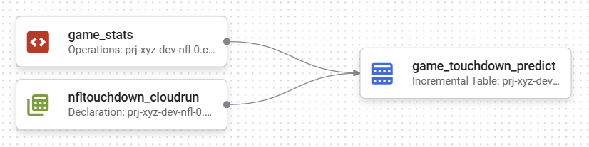
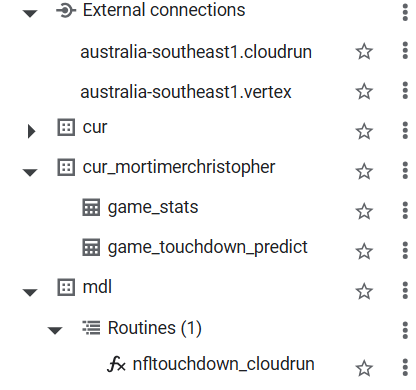
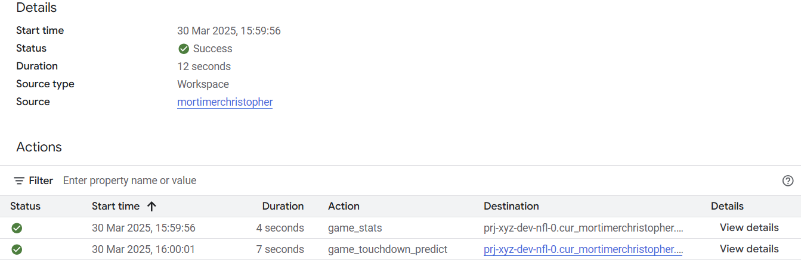
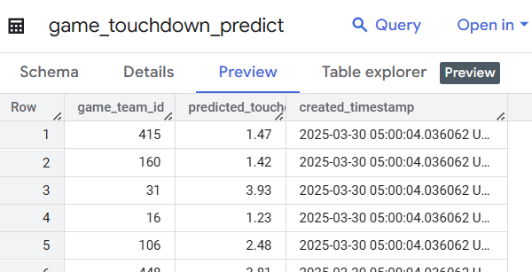

# NFL Touchdown Prediction with Dataform and BigQuery ML

This repository demonstrates how to build an end-to-end ML pipeline using Google Cloud Platform (GCP) services to predict NFL game touchdowns.

There is a lot more that is setup and explained in:

[https://github.com/mortie23/ml/tree/master/model/nfl/touchdown](https://github.com/mortie23/ml/tree/master/model/nfl/touchdown)
[https://github.com/mortie23/ml/blob/master/docs/model/nfl/README-predict-serve.md](https://github.com/mortie23/ml/blob/master/docs/model/nfl/README-predict-serve.md)

## Architecture

The solution uses:

- Dataform for data transformation and pipeline orchestration
- BigQuery for data storage and SQL operations
- Cloud Run for hosting the ML model endpoint
- Python for ML model training (stored separately)

## Project Structure

```
ml-df/
├── 📁definitions/         # Dataform SQL definitions
│   ├── 📁t0_mdl/          # Model declarations
│   ├── 📁t1_raw/          # Raw data loading
│   └── 📁t2_cur/          # Curated/transformed/predicted data
├── 📁docs/                # Documentation and screenshots
│   ├── 📁img/             # Screenshots
└── workflow_settings.yaml # Dataform configuration
```

## Setup and Usage

1. Set up a GCP project with BigQuery, Dataform and many other GCP infra components enabled
2. Fork this repository and setup a workspace in Dataform
3. Configure `workflow_settings.yaml` with your project details
4. Run the Dataform pipeline

## Pipeline Flow



1. Raw NFL game statistics are loaded into BigQuery
2. Data is transformed and prepared for prediction
3. Each game's features are sent to the ML model endpoint
4. Predictions are stored back in BigQuery

### Example BigQuery objects



### Example execution



### Example results


